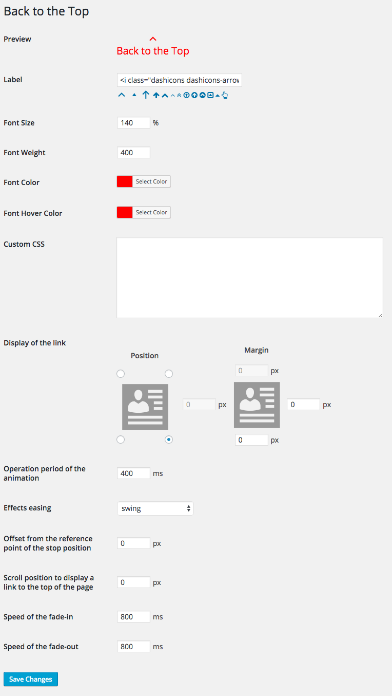

# Introducing Back to the Top

Back to the Top is a WordPress plugin that return to scroll smoothly to the top of the page. You can scroll to the smooth anchor link in the page.


Back to the Top will add a link that return the top of the page for your website. You can customize label, color, display and so in the options page. You don't need to edit your theme.

Back to the Top is also a jQuery plugin. [Back to the Top Project Page here.](http://project.thingslabo.com/jquery.backtothetop) You can set easily WordPress plugin ’Back to the Top’ than jQuery plugin ones.

### Features

* Customizable options in the options page
* Selectable the effects easing of the scroll
* The iconic font supported, Dashicons and Font Awesome

## Install Back to the Top

1. Download and unzip files. Or install 'Back to the Top' plugin using the WordPress plugin installer. In that case, skip 2.
2. Upload 'backtothetop' to the '/wp-content/plugins/' directory.
3. Activate the plugin through the 'Plugins' menu in WordPress.
5. Go to the 'Back to the Top' options page through the 'Appearance' menu in WordPress.
4. Have fun!

## Options page screenshot



## Customize Stylesheet

You can customize Stylesheet by the Custom CSS. See the following example.

```css
a#backtothetop-fixed {
	background: #f1f1f1;
	border-radius: 10%;
	padding: 0.2em;
}
a#backtothetop-fixed:hover {
	background: #fefefe;
}
```

## WordPress Plugin Directory

Back to the Top is hosted on the WordPress Plugin Directory.

[https://wordpress.org/plugins/back-to-the-top/](https://wordpress.org/plugins/back-to-the-top/)

## Test Matrix

For operation compatibility between PHP version and WordPress version, see below [Github Actions](https://github.com/thingsym/back-to-the-top/actions).

## Contribution

### Patches and Bug Fixes

Small patches and bug reports can be submitted a issue tracker in Github. Forking on Github is another good way. You can send a pull request.

1. Fork [Back to the Top](https://github.com/thingsym/back-to-the-top) from GitHub repository
2. Create a feature branch: git checkout -b my-new-feature
3. Commit your changes: git commit -am 'Add some feature'
4. Push to the branch: git push origin my-new-feature
5. Create new Pull Request

## Changelog

* Version 1.1.1
	* update wp-plugin-unit-test.yml
	* bump up yoast/phpunit-polyfills version
	* change os to ubuntu-20.04 for ci
	* add Upgrade Notice
	* change requires at least to wordpress 4.9
	* change requires to PHP 5.6
	* add test case
* Version 1.1.0
	* add composer scripts
	* update japanese translation
	* update pot
	* update composer dependencies
	* add test case
	* change method name from admin_init to register_settings
	* change method name from validate to validate_options
	* fix textdomain
	* add plugin_metadata_links method
	* change add_filter to plugin_action_links_**
	* add init method
	* add Constants
	* add checking Back_to_the_Top class
	* add checking ABSPATH
	* add load_textdomain method
	* remove protected variable
	* change from protected variable to public variable for unit test
	* update composer.json
	* add timeout-minutes to workflows
	* add phpunit-polyfills
	* update wordpress-test-matrix
	* add sponsor link
	* add FUNDING.yml
	* add GitHub actions for CI/CD, remove .travis.yml
* Version 1.0.5
	* fix indent and reformat with phpcs and phpcbf
	* add composer.json for test
	* add static code analysis config
* Version 1.0.4
	* change Requires at least from 3.4 to 4.0
	* improve CI environment
	* updated: update jquery.backtothetop.js v1.1.7
* Version 1.0.3
	* fixed: fix backtothetop.admin.js
	* updated: update jquery.backtothetop.js v1.1.6
* Version 1.0.2
	* fixed: fix handle and option name
	* fixed: fix typo
* Version 1.0.1
	* fixed: refactoring by the PHP_CodeSniffer
	* updated: update jquery.backtothetop.js v1.1.5
	* added: add PHPUnit and tests
* Version 1.0.0
	* initial release

## Upgrade Notice

* Version 1.1.1
	* Requires at least version 4.9 of the WordPress
	* Requires PHP version 5.6
* Version 1.0.4
	* Requires at least version 4.0 of the WordPress

## License

Licensed under [GPLv2](https://www.gnu.org/licenses/gpl-2.0.html).
