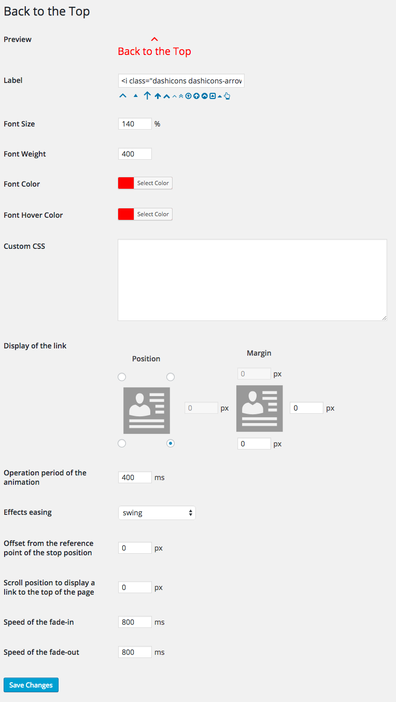

# Introducing Back to the Top

[](https://travis-ci.org/thingsym/back-to-the-top)

Back to the Top is a WordPress plugin that return to scroll smoothly to the top of the page. You can scroll to the smooth anchor link in the page.


Back to the Top will add a link that return the top of the page for your website. You can customize label, color, display and so in the options page. you don't need to edit your theme.

Back to the Top is Also a jQuery plugin. [Back to the Top Project Page here.](http://project.thingslabo.com/jquery.backtothetop) You can set easily WordPress plugin ’Back to the Top’ than jQuery plugin ones.

### Features

* Customizable options in the options page
* Selectable the effects easing of the scroll
* The iconic font supported, Dashicons and Font Awesome


## Install Back to the Top

1. Download and unzip files. Or install 'Back to the Top' plugin using the WordPress plugin installer. In that case, skip 2.
2. Upload 'backtothetop' to the '/wp-content/plugins/' directory.
3. Activate the plugin through the 'Plugins' menu in WordPress.
5. Go to the 'Back to the Top' options page through the 'Appearance' menu in WordPress.
4. Have fun!

## Options page screenshot



## Customize Stylesheet

You can customize Stylesheet by the Custom CSS. See the following example.

```css
a#backtothetop-fixed {
	background: #f1f1f1;
	border-radius: 10%;
	padding: 0.2em;
}
a#backtothetop-fixed:hover {
	background: #fefefe;
}
```


## Changelog

* Version 1.0.0
	* Initial release
